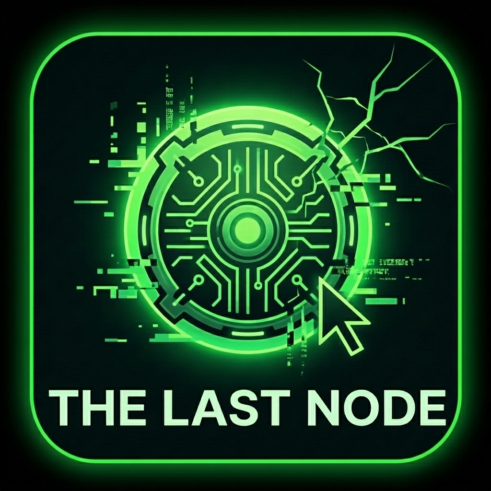

# ❖ THE LAST NODE // CORE_v1.0

🌍 **[PLAY NOW](https://enesozkanilici.github.io/TheLastNode/)**

---

> **"Hours left until the global network collapse. As the world plunges into digital darkness, the VertexWhile community has produced one final countermeasure: the DTA-27 Autonomous Infiltration Unit. Mission: Integrate the unit into the network, bypass 90 nodes, and pull the plug on the system."**

**THE LAST NODE** is a fully browser-based (HTML5/JS) dynamic puzzle and algorithm game that transforms the ancient mathematical **Josephus Problem** into a cyberpunk survival dungeon. A **VertexWhile** product.

### ⚡ Features
* **Mathematical Core:** All game dynamics rely on a sequential node destruction (Josephus) algorithm calculated using modular arithmetic.
* **Dynamic Difficulty:** Over 90 levels, N (Node Count) and K (Step Count) values increase through a specific modular structure based on the learning curve, rather than randomly.
* **5 Different Cyberpunk Themes:** Outer Gateway, Defense Line, Quarantine_X, Absolute Core, and System Void.
* **Thematic Crisis Cinematics:** Custom HTML5 Canvas animations depicting radar scans, system glitches, and reality fractures that activate in the first level of each theme.
* **Responsive Design:** An interface that fully adapts to any screen size (100% browser ratio) with zero overflow, built using Tailwind CSS.
* **Local Storage:** Completed levels and collected gold are instantly saved to the browser's local storage.

### 🚀 Gameplay & Installation
The project is a Single Page Application (SPA) requiring no server or dependency installation. You can play it directly via your browser:

🎮 **[Play The Last Node via GitHub Pages](https://enesozkanilici.github.io/TheLastNode/)**# ❖ THE LAST NODE // CORE_v1.0

🛠️ Technical Architecture
This project was initially prototyped as a heavy desktop application (Python/Tkinter), and was later entirely ported to Web technologies (HTML5 Canvas & JS) to achieve performance optimizations and overcome memory leak issues.

User Interface: HTML5, Tailwind CSS

Game Engine: Vanilla JavaScript, HTML5 Canvas API

Data Management: LocalStorage API

👨‍💻 Developer & Team
Algorithm & Core System: Enes Özkanalıcı

Design & Porting: VertexWhile Team

🌍 **[HEMEN OYNA](https://enesozkanilici.github.io/TheLastNode/)**

---

> **"Küresel ağ çöküşüne saatler kaldı. Dünya dijital bir karanlığa gömülmek üzereyken, VertexWhile topluluğu son bir hamleyle DTA-27 Otonom Sızma Birimini üretti. Görev: Birimi ağa entegre et. 90 düğümü aş ve sistemin fişini çek."**

**THE LAST NODE**, antik matematiksel **Josephus Problemi**'ni siberpunk bir hayatta kalma zindanına dönüştüren, tamamen tarayıcı tabanlı (HTML5/JS) dinamik bir bulmaca ve algoritma oyunudur. Bir **VertexWhile** ürünüdür.

### ⚡ Özellikler
* **Matematiksel Çekirdek:** Tüm oyun dinamikleri, modüler aritmetik kullanılarak hesaplanan ardışık düğüm imha (Josephus) algoritmasına dayanır.
* **Dinamik Zorluk:** 90 bölüm boyunca N (Taş Sayısı) ve K (Atlama Sayısı) değerleri rastgele değil, öğrenme eğrisine dayalı özel bir modüler kurguyla artar.
* **5 Farklı Siberpunk Tema:** Dış Ağ Geçidi, Savunma Hattı, Karantina_X, Mutlak Çekirdek ve Sistem Hiçliği.
* **Tematik Kriz Sinematikleri:** Her temanın ilk bölümünde devreye giren; radar taramaları, sistem hataları (glitch) ve gerçeklik kırılmalarını yansıtan özel HTML5 Canvas animasyonları.
* **Esnek Tasarım:** Tailwind CSS kullanılarak her ekran boyutuna (%100 tarayıcı oranı) sıfır taşma ile tam uyum sağlayan arayüz.
* **Yerel Hafıza:** Tamamlanan seviyeler ve toplanan altınlar anında tarayıcı hafızasına (Local Storage) kaydedilir.

### 🚀 Oynanış & Kurulum
Proje, herhangi bir sunucu veya bağımlılık (dependency) kurulumu gerektirmeyen tek sayfalık bir web uygulamasıdır (SPA). Doğrudan tarayıcınız üzerinden oynayabilirsiniz:

🎮 **[The Last Node'u GitHub Pages Üzerinden Oyna](https://enesozkanilici.github.io/TheLastNode/)**

🛠️ Teknik Altyapı
Bu proje, başlangıçta ağır bir masaüstü uygulaması (Python/Tkinter) olarak prototiplenmiş, performans optimizasyonları ve bellek sızıntısı (memory leak) sorunlarının aşılması amacıyla daha sonradan tamamen Web teknolojilerine (HTML5 Canvas & JS) taşınmıştır.

Arayüz: HTML5, Tailwind CSS

Oyun Motoru: Vanilla JavaScript, HTML5 Canvas API

Veri Yönetimi: LocalStorage API

👨‍💻 Geliştirici & Takım
Algoritma & Çekirdek Sistem: Enes Özkanalıcı

Dizayn & Taşıma (Porting): VertexWhile Ekibi
